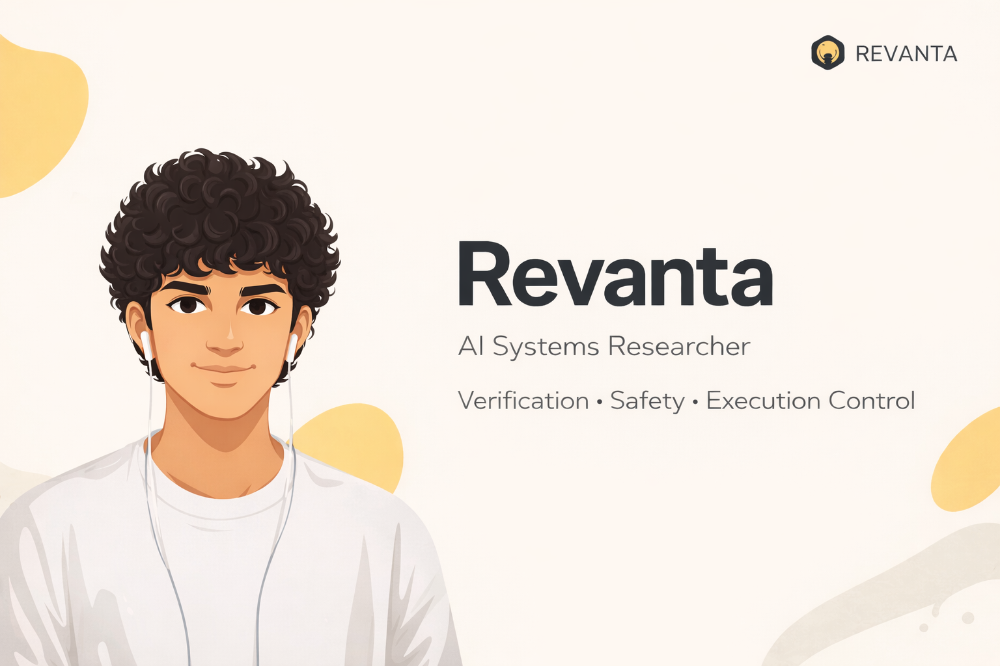

  

<h1 align="center">Revanta Mishra</h1>

  <strong>AI Systems Researcher</strong> 
  Safety · Verification · Execution Control

  I design <strong>model-agnostic control and verification layers</strong> 
  that constrain, authorize, and govern the execution of AI systems, 
  independent of the underlying model or architecture.

